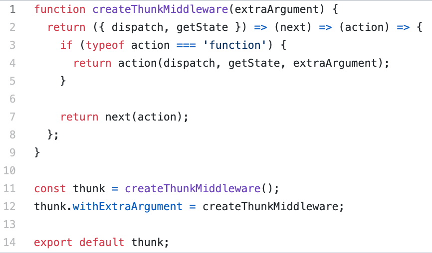
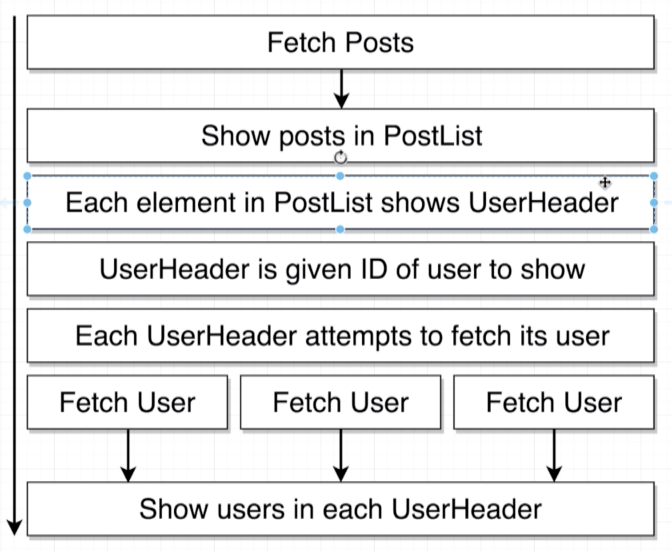

# Redux lesson with redux-thunk

This is a basic lesson on redux and redux-thunk. 
Most aspects of React will not be explained for brevity's sake
No Styling will be addressed at all

## Recap on The Redux Cycle


## Redux cycle with redux-thunk
* NB: Notice that dispatch now passes the action to middleware (thunk) before the reducers.
* This middleware relaxes the rules around action creators


## Step 1: Setting up a react-redux app
Goals of this step:
* Set up a basic React app
* Install dependencies
* Replace boilerplate from create-react-app
* Set up bare minimum for a viable react-redux app
* Hook up the semantic UI stylesheet

####  1.1 Install dependencies
`npm i redux react-redux axios redux-thunk`
 - [x] redux: The redux library. 
 - [x] react-redux: Integration layer between react and redux.
 - [x] axios: Network/http requests
 - [x] redux-thunk: Middleware to help make requests in a redux app

 Now that our dependencies are installed we can set up the rest of the app. 

####  1.1 Index.js

```
import React from 'react' // Mandatory import for a react file
import ReactDOM from 'react-dom' // Need this to help render app
import { Provider } from 'react-redux' // The new "parent component of the app"
import { createStore } from 'redux' // Function to create the global state 'store' NB must pass it reducers

import App from './components/App' // The "App"
import reducers from './reducers' // The reducers which will be passed to the createStore function

ReactDOM.render(
  <Provider store={createStore(reducers)}>
    <App />
  </Provider>,
  document.querySelector('#root')
)

```
Extra notes:

* createStore: The createStore function is imported from redux. We pass it the reducers and it returns back the redux store
* provider: The <Provider> must be passed the store. The store is created via createStore(reducers) The new parent component of App. ie it wraps App. App will now have access to the global state

####  1.2 App.js

Create a directory in src called `components` 
Create a file called `App.js` inside of `src/components`

```
import React from 'react' // Mandatory import for a react file

function App () {
  return (
    <div className='ui container'>
      <h1>Your app is running</h1>
    </div>
  )
}

export default App

```

Extra notes:

* remember that all classNames are coming from an external stylesheet

####  1.3 Reducers

Create a directory in src called `reducers` inside the src directory
Creare a file called `index.js` inside `src/reducers/index.js`

```
import { combineReducers } from 'redux' // Function to combine all the reducers which will be later used to make the store


export default combineReducers({
  dummyReducer: () => {
    return 'placeholder'
  }
})
```

Extra notes: 

* combineReducers: Function to combine all the reducers which will be later used to make the store
* The keys of the object inside combineReducers are going to be the keys that show up in the global state object.
* Currently there is dummy data in it to get an error message to not display in the console

#### 1.4 Stylesheet

* Add `<Link rel="stylesheet" href="https://cdnjs.cloudflare.com/ajax/libs/semantic-ui/2.4.1/semantic.min.css" />` to the head of `public/index.html`

## Step 2: Adding in redux-thunk with axios API request
Goals of this step: 
* Explain redux-thunk
* Configure index.js for redux-thunk
* Setup PostList component
* Explain the flow of general loading of data into a react-redux app
* Set up `axios`
* Action creators must be plain objects
* Redux-thunk -  dispatch => middleware => reducers

#### 2.0 Importing data into a React-redux project

Standard flow of importing data into a react-redux app


1. A Component gets rendered onto the screen.
2. The Class Components `componentDidMount` lifecycle method is called.
3. Write the Action Creator **within** the `componentDidMount`. So that it is called as soon as the component renders on the screen.
4. The action creator will have the code to make the `axios` API request
5. The API will respond with data.
6. The action creator will return an action. The fetched data will be on the `payload` property. Dispatch sends the action to all the reducers.
7. Some **specific** reducer with the appropriate `type` property will then return the data off the `payload` property. 
8. Because we have produced a new state object, react/react-redux will cause our react app to be rerendered with our new data.

#### 2.1 What is Redux-Thunk

Redux-thunk is a middleware which helps relax the rules around action creators. 
Becasue of the way the app is transpiled to ES5, we cannot use functions in action creators without the use of redux-thunk.
Redux-thunk is actually incredibly simple.

Here is a link to the repo: `https://github.com/reduxjs/redux-thunk/blob/master/src/index.js`
This is everything:


A recap on how the rules of action creators. 


Redux thunks relaxed rules. 

In a nutshell: Redux thunk allows action creators to return either a plain js object **or** a function


A Very broad overview of how redux thunk works. 
* Redux thunk can now receive either a plain JS object or a function. 
* Therefore it checks the input to see what it is. 
* When redux thunk receives an object it ignores it, and the flow of data procedes as per usual and it passes it onto the reducers. 
* When redux thunk receives a function 
    * It invokes the function with 2 arguments dispatch and getState
    * Waits for the request to finish
    * When it is finished we manually dispatch the action. 
    * We then have the action which is a plain JS object from the action creator. 
    * The action is then passed back to dispatch an redux-thunk will ignore it. 


#### 2.2 Index.js: Configure index.js for thunk

* additional imports
    * `import { createStore, applyMiddleware } from 'redux'`
        * 1) Function to create the global state 'store' NB must pass it reducers. 2) Applies middleware
    * `import thunk from 'redux-thunk'`
        * Middleware that helps us handle action creators which return a function
* `const store = createStore(reducers, applyMiddleware(thunk))`
    * store must now have applyMiddleware(thunk) as a second argument
```
import React from 'react' // Mandatory import for a react file
import ReactDOM from 'react-dom' // Need this to help render app
import { Provider } from 'react-redux' // The new "parent component of the app"
import { createStore, applyMiddleware } from 'redux' // 1) Function to create the global state 'store' NB must pass it reducers. 2) Applies middleware
import thunk from 'redux-thunk' // Middleware that helps us handle action creators which return a function

import App from './components/App' // The "App"
import reducers from './reducers' // The reducers which will be passed to the createStore function

const store = createStore(reducers, applyMiddleware(thunk))

ReactDOM.render(
  <Provider store={store}>
    <App />
  </Provider>,
  document.querySelector('#root')
)
```

#### 2.3 jsonPlaceholder.js: Create an instance of axios


```
import axios from 'axios' // the package we will be making http requests with

export default axios.create({
  baseURL: 'https://jsonplaceholder.typicode.com'
})

```

Extra notes:
* This creates an instance of axios
* The base url is used instead of the entire end point becasue it makes our code more reuseable


#### 2.4 Creating action creators
* create a actions directory in src
* create a index.js in `src/actions`

```
import jsonPlaceholder from '../apis/jsonPlaceholder' // import preconfigured axios instance

// Shorthand
export const fetchPosts = () => async dispatch => {
  const response = await jsonPlaceholder.get('/posts')
  dispatch({ type: 'FETCH_POSTS', payload: response })
}

// Longhand
// export const fetchPosts = () => {
//   return async (dispatch, getState) => {
//     const response = await jsonPlaceholder.get('/posts')
//     dispatch({ type: 'FETCH_POSTS', payload: response })
//   }
// }

```
Extra notes:
* fetch posts action creator.
* Normally action creators **only** return plain JS objects
* Redux-thunk relaxes the rules of action creators.
* Because of these relaxed rules. Action creators can now return functions **OR** plain objects
* This will be very common with API requests because.
* All they are, are functions which return functions


#### 2.5 PostList 

* Create a class component called PostList `in src/components`
* It will have 1 life cycle method, `componentDidMount`
* The Action creator **must** be called from within here 

```
import React, { Component } from 'react' // Importing react and Component
import { connect } from 'react-redux' // Connect communicates directly with the provider and therefore the global store
import { fetchPosts } from '../actions' // The action creator fetchPosts

// Class component
class PostList extends Component {
  // Life Cycle method runs once when the component first renders
  componentDidMount () {
    this.props.fetchPosts() // Action creator is called here. made avalible via props because of mapStateToProps()
  }
  render () {
    return (
      <div>
        <h1>Post List</h1>
      </div>
    )
  }
}

export default connect(null, { fetchPosts })(PostList)
```
Extra notes: 
* connect:
    * First argument = mapStateToProps
    * Second argument = object with the action creator
    * Communicate directly with the provider. They are now 'connected'
    * In this case it is communicating specifically with the LostList key:value && The fetchPosts action creator
    * Then connect passes the state and action creator to the PostList component via props
* mapStateToProps:
    * Takes the global state, and converts it into the props system within the component.

#### 2.6 App: Importing the PostList component into App
Changes:
* Importing `PostList`
* Rendering `PostList`

```
import React from 'react' // Mandatory import for a react file
import PostList from './PostList' // Import the PostList component

function App () {
  return (
    <div className='ui container'>
      <PostList />
    </div>
  )
}

export default App

```

## Step 3: Reducers, State, Mutation and more

#### 3.0 Reducers

background info: 
  * When redux first boots up it runs reducers one time. 


1. Return any value besides undefined, otherwise it **will** error. (Default 1st arg as null)
2. Only has access to the previous state and the action. 
    * ie there is a cyclic action where the reducer is constantly called with its previous return value
    * Only the action changes
3. Reducers must **not** reach outside of itself to return state
  
4. DO NOT MUTATE STATE
    * It wont error... So just dont do it
    * When js checks to see if there is a difference between the old state and the new state it does not look at the actual contents of the arr/obj
    * Instead it looks at the point in memory (which are equal)
    * Remember a component will re-render if its state changes. 
    * So if a component's state is mutated it will never rerender


#### 3.1 State and how to update it safely
As previously discussed we dont want to mutate state **but** we need to change it somehow. 
This is how we will change state from now onwards.


#### 3.2 Switch statements in reducers
It is common to see a switch statement inside of a reducer instead of an if statement. 
Although in this case is is not necessary. 
```
export default (state = [], action) => {
  switch (action.type) {
    case 'FETCH_POSTS':
      return action.payload
    default:
      return state
  }
}

```

#### 3.3 PostList component: Finally getting data into the component
Remember: 
  * Anytime we want to get some data from the redux side of the application into the react side we must define the `mapStateToProps()` function and pass it off to connect. 
  * every time the reducer runs `mapStateToProps()` also runs. 
    ```
    const mapStateToProps = state => {
    return { posts: state.posts }
    }

    export default connect(mapStateToProps, { fetchPosts })(PostList)
    ```

  * Build a custom renderList() method to render out the jsx. 
    ```
    renderList () {
    return this.props.posts.map(post => {
      return (
        <div className='item' key={post.id}>
          <i className='large middle aligned icon user' />
          <div className='content'>
            <div className='description'>
              <h2>
                {post.title}
              </h2>
              <p>
                {post.body}
              </p>
            </div>
          </div>
        </div>
      )
    })
    }
    ```

#### 3.4 Advanced data fetching (multiple axios calls)

* Each element in PostList must display it's author. 
* Because of the way the end points are set up, the posts do not have the author names attached to them.
* Instead they have the author ID.
* Therefore the data flow will be to pass the id to the UserHeader component.
* The UserHeader component then makes the api call to fetch its specific author.
* Data flow as below




Here is an overview of the action creators needed to achieve this: 


Example of the action creator which will meet the requirements

```
// the id needs to be passed in
export const fetchUser = id => async dispatch => {
  const response = await jsonPlaceholder.get(`/users/${id}`)
  dispatch({ type: 'FETCH_USER', payload: response.data })
}
```

